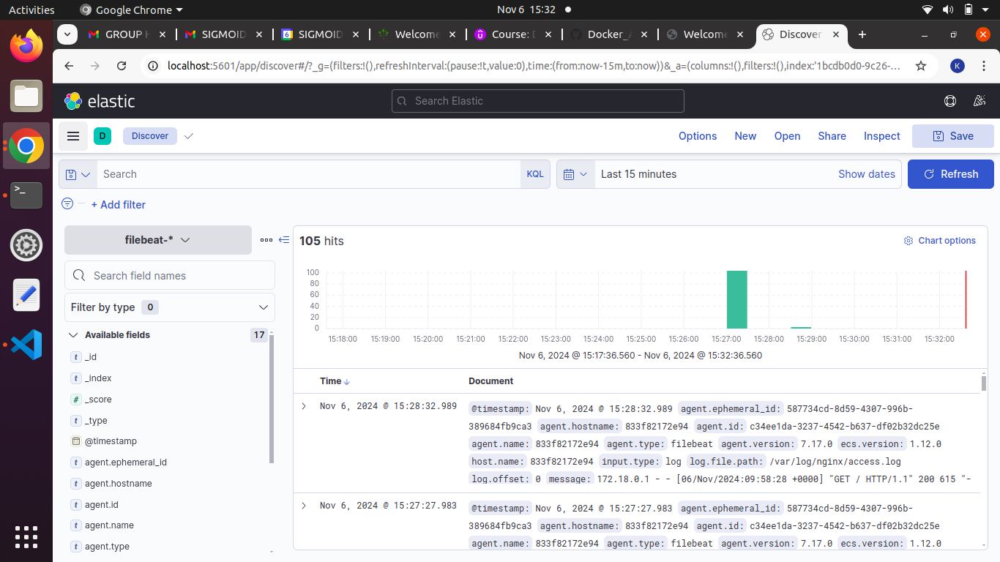

# EFK Stack Log Monitor

Monitoring ```nginx``` logs using EFK stack (Elasticsearch, Filebeat, Kibana)

## Description

- Nginx access and error logs are written to a directory. The directory is mapped to a local volume.
- Filebeat reads the nginx logs from the local volume and sends it to an Elasticsearch index [filebeat-*].
- Kibana uses the index to visualize the access and the error logs.


## Getting Started

### Dependencies

* bash
* docker
* docker-compose

### Docker Images

* ```nginx:latest```
* ```elasticsearch:7.17.0```
* ```elastic/filebeat:7.17.0```
* ```kibana:7.17.0```


### Installing and Executing

* Download or clone the project to your local machine
* Navigate to the project folder
* Run the following commands in the terminal:

run the containers in background

```
docker-compose up -d
```
view running containers [4 should be active]

```
docker ps
```
checking for nginx
```
curl -X GET “localhost:80”
```
checking for elasticsearch

```
curl -X GET “localhost:9200”
```
stop the containers

```
docker-compose down
```

* You can view the kibana application here: [localhost:5601](http://localhost:5601)

## Output

